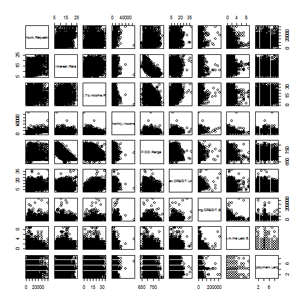

ASSIGNMENT 1 - LENDING CLUB LOANS DATA
========================================================
Load required libraries

```r
library(lsr)
```


Read in the data and check the structure of the data along with the first few rows

```r
data <- read.csv("C:\\Users\\Bahae Omid\\Desktop\\Data Analysis with R\\Assignments\\Assignment 1\\Data\\Raw Data\\loansdata.csv")
str(data)
```

```
## 'data.frame':	2500 obs. of  14 variables:
##  $ Amount.Requested              : int  20000 19200 35000 10000 12000 6000 10000 33500 14675 7000 ...
##  $ Amount.Funded.By.Investors    : num  20000 19200 35000 9975 12000 ...
##  $ Interest.Rate                 : Factor w/ 275 levels "10.00%","10.08%",..: 263 40 214 275 33 121 254 154 96 239 ...
##  $ Loan.Length                   : Factor w/ 2 levels "36 months","60 months": 1 1 2 1 1 1 1 2 1 1 ...
##  $ Loan.Purpose                  : Factor w/ 14 levels "car","credit_card",..: 3 3 3 3 2 10 3 2 2 2 ...
##  $ Debt.To.Income.Ratio          : Factor w/ 1669 levels "0%","0.04%","0.17%",..: 390 1178 1000 346 657 775 1102 374 1129 1488 ...
##  $ State                         : Factor w/ 46 levels "AK","AL","AR",..: 37 39 5 16 28 7 19 18 5 5 ...
##  $ Home.Ownership                : Factor w/ 5 levels "MORTGAGE","NONE",..: 1 1 1 1 5 4 5 1 5 5 ...
##  $ Monthly.Income                : num  6542 4583 11500 3833 3195 ...
##  $ FICO.Range                    : Factor w/ 38 levels "640-644","645-649",..: 20 16 11 12 12 7 17 14 10 16 ...
##  $ Open.CREDIT.Lines             : int  14 12 14 10 11 17 10 12 9 8 ...
##  $ Revolving.CREDIT.Balance      : int  14272 11140 21977 9346 14469 10391 15957 27874 7246 7612 ...
##  $ Inquiries.in.the.Last.6.Months: int  2 1 1 0 0 2 0 0 1 0 ...
##  $ Employment.Length             : Factor w/ 12 levels "< 1 year","1 year",..: 1 4 4 7 11 5 3 3 10 5 ...
```

```r
head(data)
```

```
##       Amount.Requested Amount.Funded.By.Investors Interest.Rate
## 81174            20000                      20000         8.90%
## 99592            19200                      19200        12.12%
## 80059            35000                      35000        21.98%
## 15825            10000                       9975         9.99%
## 33182            12000                      12000        11.71%
## 62403             6000                       6000        15.31%
##       Loan.Length       Loan.Purpose Debt.To.Income.Ratio State
## 81174   36 months debt_consolidation               14.90%    SC
## 99592   36 months debt_consolidation               28.36%    TX
## 80059   60 months debt_consolidation               23.81%    CA
## 15825   36 months debt_consolidation               14.30%    KS
## 33182   36 months        credit_card               18.78%    NJ
## 62403   36 months              other               20.05%    CT
##       Home.Ownership Monthly.Income FICO.Range Open.CREDIT.Lines
## 81174       MORTGAGE           6542    735-739                14
## 99592       MORTGAGE           4583    715-719                12
## 80059       MORTGAGE          11500    690-694                14
## 15825       MORTGAGE           3833    695-699                10
## 33182           RENT           3195    695-699                11
## 62403            OWN           4892    670-674                17
##       Revolving.CREDIT.Balance Inquiries.in.the.Last.6.Months
## 81174                    14272                              2
## 99592                    11140                              1
## 80059                    21977                              1
## 15825                     9346                              0
## 33182                    14469                              0
## 62403                    10391                              2
##       Employment.Length
## 81174          < 1 year
## 99592           2 years
## 80059           2 years
## 15825           5 years
## 33182           9 years
## 62403           3 years
```


Data Cleaning:coerce interest rate, FICO score, Employment Length and Debt to Income Ratio to numeric

```r
data$Interest.Rate <- as.numeric(gsub("[%]", "", data$Interest.Rate))
data$Debt.To.Income.Ratio <- as.numeric(gsub("[%]", "", data$Debt.To.Income.Ratio))
# Replace FICO Range with upper value of the range
data$FICO.Range <- as.numeric(gsub("[0-9]+-", "", data$FICO.Range))
# Replacing employment length of <1 year with 0, 10+ years with 10, and n/a
# with mean of the column
data[data[, 14] == "< 1 year", 14] <- 0
```

```
## Warning: invalid factor level, NA generated
```

```r
data[data[, 14] == "10+ years", 14] <- 10
```

```
## Error: missing values are not allowed in subscripted assignments of data
## frames
```

```r
data$Employment.Length <- gsub(" years| year", "", data$Employment.Length)
data$Employment.Length <- as.numeric(data$Employment.Length)
```

```
## Warning: NAs introduced by coercion
```

```r
data[is.na(data$Employment.Length), 14] <- mean(data$Employment.Length, na.rm = T)
```


Exploratory Analysis: Data summary

```r
summary(data)
```

```
##  Amount.Requested Amount.Funded.By.Investors Interest.Rate  
##  Min.   : 1000    Min.   :    0              Min.   : 5.42  
##  1st Qu.: 6000    1st Qu.: 6000              1st Qu.:10.16  
##  Median :10000    Median :10000              Median :13.11  
##  Mean   :12406    Mean   :12002              Mean   :13.07  
##  3rd Qu.:17000    3rd Qu.:16000              3rd Qu.:15.80  
##  Max.   :35000    Max.   :35000              Max.   :24.89  
##                                                             
##     Loan.Length               Loan.Purpose  Debt.To.Income.Ratio
##  36 months:1952   debt_consolidation:1307   Min.   : 0.00       
##  60 months: 548   credit_card       : 444   1st Qu.: 9.75       
##                   other             : 201   Median :15.32       
##                   home_improvement  : 152   Mean   :15.38       
##                   major_purchase    : 101   3rd Qu.:20.67       
##                   small_business    :  87   Max.   :34.91       
##                   (Other)           : 208                       
##      State       Home.Ownership Monthly.Income     FICO.Range 
##  CA     : 433   MORTGAGE:1148   Min.   :   588   Min.   :644  
##  NY     : 255   NONE    :   1   1st Qu.:  3500   1st Qu.:684  
##  TX     : 174   OTHER   :   5   Median :  5000   Median :704  
##  FL     : 169   OWN     : 200   Mean   :  5689   Mean   :710  
##  IL     : 101   RENT    :1146   3rd Qu.:  6800   3rd Qu.:729  
##  GA     :  98                   Max.   :102750   Max.   :834  
##  (Other):1270                   NA's   :1                     
##  Open.CREDIT.Lines Revolving.CREDIT.Balance Inquiries.in.the.Last.6.Months
##  Min.   : 2.0      Min.   :     0           Min.   :0.000                 
##  1st Qu.: 7.0      1st Qu.:  5586           1st Qu.:0.000                 
##  Median : 9.0      Median : 10962           Median :0.000                 
##  Mean   :10.1      Mean   : 15245           Mean   :0.906                 
##  3rd Qu.:13.0      3rd Qu.: 18889           3rd Qu.:1.000                 
##  Max.   :38.0      Max.   :270800           Max.   :9.000                 
##  NA's   :2         NA's   :2                NA's   :2                     
##  Employment.Length
##  Min.   :1.00     
##  1st Qu.:3.00     
##  Median :4.29     
##  Mean   :4.29     
##  3rd Qu.:5.00     
##  Max.   :9.00     
## 
```


Although there's an unusual data point in amount funded by investors(-0.01) but we're going to ignore this since we won't need this column for our analysis

```r
data <- data[-2]
```


There's a very odd data point in monthly income($102,750). We're going to assume this to be an outlier since it's very unlikely for somebody with this monthly income to ask for a small loan

```r
data <- data[-which.max(data$Monthly.Income), ]
```


Scanning for missing values

```r
sapply(data, function(x) sum(is.na(x)))
```

```
##               Amount.Requested                  Interest.Rate 
##                              0                              0 
##                    Loan.Length                   Loan.Purpose 
##                              0                              0 
##           Debt.To.Income.Ratio                          State 
##                              0                              0 
##                 Home.Ownership                 Monthly.Income 
##                              0                              1 
##                     FICO.Range              Open.CREDIT.Lines 
##                              0                              2 
##       Revolving.CREDIT.Balance Inquiries.in.the.Last.6.Months 
##                              2                              2 
##              Employment.Length 
##                              0
```

```r
# Check the rows with missing values and see if they can be excluded from
# the analysis
data[which(is.na(data$Open.CREDIT.Lines)), ]
```

```
##        Amount.Requested Interest.Rate Loan.Length Loan.Purpose
## 101596             5000          7.43   36 months        other
## 101515             3500         10.28   36 months        other
##        Debt.To.Income.Ratio State Home.Ownership Monthly.Income FICO.Range
## 101596                    1    NY           NONE             NA        804
## 101515                   10    NY           RENT          15000        689
##        Open.CREDIT.Lines Revolving.CREDIT.Balance
## 101596                NA                       NA
## 101515                NA                       NA
##        Inquiries.in.the.Last.6.Months Employment.Length
## 101596                             NA             4.294
## 101515                             NA             4.294
```

```r
# Removing the rows with missing values since they won't affect our analysis
# significantly
data <- data[-which(is.na(data$Open.CREDIT.Lines)), ]
```


Checking correlations among all variables and plotting pairwise scatter for illustration

```r
cor(data[, sapply(data, class) != "factor"])
```

```
##                                Amount.Requested Interest.Rate
## Amount.Requested                        1.00000       0.33379
## Interest.Rate                           0.33379       1.00000
## Debt.To.Income.Ratio                    0.08360       0.17135
## Monthly.Income                          0.41978       0.02954
## FICO.Range                              0.08062      -0.70912
## Open.CREDIT.Lines                       0.19696       0.08999
## Revolving.CREDIT.Balance                0.29026       0.06366
## Inquiries.in.the.Last.6.Months         -0.02883       0.16434
## Employment.Length                       0.06681       0.03564
##                                Debt.To.Income.Ratio Monthly.Income
## Amount.Requested                            0.08360        0.41978
## Interest.Rate                               0.17135        0.02954
## Debt.To.Income.Ratio                        1.00000       -0.16372
## Monthly.Income                             -0.16372        1.00000
## FICO.Range                                 -0.21520        0.10908
## Open.CREDIT.Lines                           0.37064        0.20441
## Revolving.CREDIT.Balance                    0.19366        0.36483
## Inquiries.in.the.Last.6.Months              0.01139        0.04726
## Employment.Length                           0.01010        0.04251
##                                FICO.Range Open.CREDIT.Lines
## Amount.Requested                 0.080625           0.19696
## Interest.Rate                   -0.709118           0.08999
## Debt.To.Income.Ratio            -0.215196           0.37064
## Monthly.Income                   0.109075           0.20441
## FICO.Range                       1.000000          -0.08882
## Open.CREDIT.Lines               -0.088819           1.00000
## Revolving.CREDIT.Balance        -0.002065           0.29244
## Inquiries.in.the.Last.6.Months  -0.091487           0.11056
## Employment.Length               -0.018389           0.03125
##                                Revolving.CREDIT.Balance
## Amount.Requested                               0.290256
## Interest.Rate                                  0.063665
## Debt.To.Income.Ratio                           0.193662
## Monthly.Income                                 0.364830
## FICO.Range                                    -0.002065
## Open.CREDIT.Lines                              0.292436
## Revolving.CREDIT.Balance                       1.000000
## Inquiries.in.the.Last.6.Months                 0.013531
## Employment.Length                              0.017503
##                                Inquiries.in.the.Last.6.Months
## Amount.Requested                                    -0.028826
## Interest.Rate                                        0.164336
## Debt.To.Income.Ratio                                 0.011394
## Monthly.Income                                       0.047264
## FICO.Range                                          -0.091487
## Open.CREDIT.Lines                                    0.110557
## Revolving.CREDIT.Balance                             0.013531
## Inquiries.in.the.Last.6.Months                       1.000000
## Employment.Length                                    0.006389
##                                Employment.Length
## Amount.Requested                        0.066807
## Interest.Rate                           0.035641
## Debt.To.Income.Ratio                    0.010100
## Monthly.Income                          0.042507
## FICO.Range                             -0.018389
## Open.CREDIT.Lines                       0.031251
## Revolving.CREDIT.Balance                0.017503
## Inquiries.in.the.Last.6.Months          0.006389
## Employment.Length                       1.000000
```

```r
pairs(data[, sapply(data, class) != "factor"])
```

 

A very strong negative correlation between Interest rate and FICO Score can be seen. Also, amount requested seems to have some association with Interest rate. Therefore, these two variables could be potential candidates to explain the dependant variable. 
We're going to exclude Revolving Credit Balance, Open Credit Lines, and Debt to Income Ratio as these seem to be highly correlated(not from the correlation matrix necessarily, rather from domain knowledge) because these variables are already confounded within the FICO Score(a research on the way the credit score is calculated reveals the fact). so we can conclude that these variables are reduntant. Including reduntant variables may skew the model due to multicollinearity.

We can do a quick check through running a linear regression model to prove this

```r
summary(lm(data$Interest.Rate ~ data$Revolving.CREDIT.Balance + data$Open.CREDIT.Lines + 
    data$Debt.To.Income.Ratio))
```

```
## 
## Call:
## lm(formula = data$Interest.Rate ~ data$Revolving.CREDIT.Balance + 
##     data$Open.CREDIT.Lines + data$Debt.To.Income.Ratio)
## 
## Residuals:
##    Min     1Q Median     3Q    Max 
## -9.083 -3.013 -0.131  2.617 12.173 
## 
## Coefficients:
##                               Estimate Std. Error t value Pr(>|t|)    
## (Intercept)                   1.14e+01   2.29e-01   49.79  < 2e-16 ***
## data$Revolving.CREDIT.Balance 5.99e-06   4.74e-06    1.26     0.21    
## data$Open.CREDIT.Lines        2.22e-02   2.03e-02    1.10     0.27    
## data$Debt.To.Income.Ratio     8.77e-02   1.19e-02    7.38  2.2e-13 ***
## ---
## Signif. codes:  0 '***' 0.001 '**' 0.01 '*' 0.05 '.' 0.1 ' ' 1
## 
## Residual standard error: 4.12 on 2493 degrees of freedom
## Multiple R-squared:  0.0308,	Adjusted R-squared:  0.0296 
## F-statistic: 26.4 on 3 and 2493 DF,  p-value: <2e-16
```

It's clear that this poor model (R2=0.03) contain variables that do not explain the interest rate.

Domain knowledge allows us to omit Inquiries in the past 6 months along with monthly income and employment length as these effects are already reflected in FICO score. so they are considered to be reduntant.

```r
data <- data[-c(8, 12, 13)]
```


So far, we've looked at the effect of the numeric variables on Interest rate. Let's generate a few boxplots to examine the effect of the factor variables on Interest Rate

```r
plot(data$Interest.Rate ~ data$Loan.Length)
```

 

```r
plot(data$Interest.Rate ~ data$Loan.Purpose)
```

 

```r
plot(data$Interest.Rate ~ data$State)
```

 

```r
plot(data$Interest.Rate ~ data$Home.Ownership)
```

 

Except for Home Ownership, the graphs suggest that there may be a difference in the mean of the groups.

let's do analysis of variance to see if this is the case (check the assumptions of anova before using this technique)

```r
model.test <- aov(data$Interest.Rate ~ data$State + data$Loan.Length + data$Loan.Purpose)
etaSquared(model.test)
```

```
##                    eta.sq eta.sq.part
## data$State        0.01749     0.02237
## data$Loan.Length  0.17679     0.18786
## data$Loan.Purpose 0.03851     0.04797
```

from the R2 values we can see that only loan length can potentially imporve our regression model in explaining the Interest Rate

After eliminating all the redundant and insignificant variables, we are ready to construct our final model with FICO Score, Amoun Requested, and Loan Length being the independant variables

```r
model.final <- lm(data$Interest.Rate ~ data$FICO.Range + data$Amount.Requested + 
    data$Loan.Length)
summary(model.final)
```

```
## 
## Call:
## lm(formula = data$Interest.Rate ~ data$FICO.Range + data$Amount.Requested + 
##     data$Loan.Length)
## 
## Residuals:
##    Min     1Q Median     3Q    Max 
## -9.763 -1.459 -0.134  1.264 10.296 
## 
## Coefficients:
##                            Estimate Std. Error t value Pr(>|t|)    
## (Intercept)                7.29e+01   8.59e-01    84.9   <2e-16 ***
## data$FICO.Range           -8.78e-02   1.21e-03   -72.3   <2e-16 ***
## data$Amount.Requested      1.38e-04   5.97e-06    23.1   <2e-16 ***
## data$Loan.Length60 months  3.29e+00   1.12e-01    29.4   <2e-16 ***
## ---
## Signif. codes:  0 '***' 0.001 '**' 0.01 '*' 0.05 '.' 0.1 ' ' 1
## 
## Residual standard error: 2.11 on 2493 degrees of freedom
## Multiple R-squared:  0.745,	Adjusted R-squared:  0.745 
## F-statistic: 2.43e+03 on 3 and 2493 DF,  p-value: <2e-16
```

It's clreat that all variables are statistically significant and the model is vrey strong (R2=0.75) explaining about 75% of the variation in Interest Rate

A plot of the final model to illustrate the associations

```r
par(mfrow = c(1, 2))
plot(data$Interest.Rate ~ data$FICO.Range, col = data$Loan.Length, pch = 19, 
    xlab = "FICO Score", ylab = "Interest Rate")
abline(c(lm(data$Interest.Rate ~ data$FICO.Range + data$Loan.Length)$coefficients[1], 
    lm(data$Interest.Rate ~ data$FICO.Range + data$Loan.Length)$coefficients[2]), 
    col = "black", lwd = 3)
abline(c(lm(data$Interest.Rate ~ data$FICO.Range + data$Loan.Length)$coefficients[1] + 
    lm(data$Interest.Rate ~ data$FICO.Range + data$Loan.Length)$coefficients[3], 
    lm(data$Interest.Rate ~ data$FICO.Range + data$Loan.Length)$coefficients[2]), 
    col = "red", lwd = 3)
legend("topright", legend = unique(data$Loan.Length), col = c("black", "red"), 
    pch = c(19, 19), cex = 0.75)
mtext(text = "(a)", side = 3, line = 1)
plot(data$Interest.Rate ~ data$Amount.Requested, col = data$Loan.Length, pch = 19, 
    xlab = "Loan Amount Requested", ylab = "Interest Rate")
abline(c(lm(data$Interest.Rate ~ data$Amount.Requested + data$Loan.Length)$coefficients[1], 
    lm(data$Interest.Rate ~ data$Amount.Requested + data$Loan.Length)$coefficients[2]), 
    col = "black", lwd = 3)
abline(c(lm(data$Interest.Rate ~ data$Amount.Requested + data$Loan.Length)$coefficients[1] + 
    lm(data$Interest.Rate ~ data$Amount.Requested + data$Loan.Length)$coefficients[3], 
    lm(data$Interest.Rate ~ data$Amount.Requested + data$Loan.Length)$coefficients[2]), 
    col = "red", lwd = 3)
legend("topleft", legend = unique(data$Loan.Length), col = c("black", "red"), 
    pch = c(19, 19), cex = 0.75)
mtext(text = "(b)", side = 3, line = 1)
```

 

```r
par(mfrow = c(1, 1))
```

As seen in figure (a), FICO Score is highly associated with Interest Rate and higher interest rates correspond to longer-term loans and lower FICO scores. figure (b) shows a strong association between Loan Amount Requested and Interest Rate and as seen, higher interest rates pertain to longer-term loans and higher amount requested.

Regression Diagnostics: checking for validity of regression model assumptions

```r
# Storing the residulas of the regression model and plotting the residuals
model.res <- resid(model.final)
plot(model.res, pch = 19)
abline(h = mean(model.res), col = "red", lwd = 2)
```

 

```r
# Checking for correlations between residuals and the independant variables
par(mfrow = c(1, 3))
plot(data$FICO.Range, model.res, col = data$Loan.Length, pch = 19)
plot(data$Amount.Requested, model.res, col = data$Loan.Length, pch = 19)
plot(data$Interest.Rate, model.res, col = data$Loan.Length, pch = 19)
```

 

```r
par(mfrow = c(1, 1))
```

The model residuals seem to be random with average of near 0 and constant variation. Moreover, the residuals do not correlate with the independant and dependant variables. so the assumption of normality is met.
